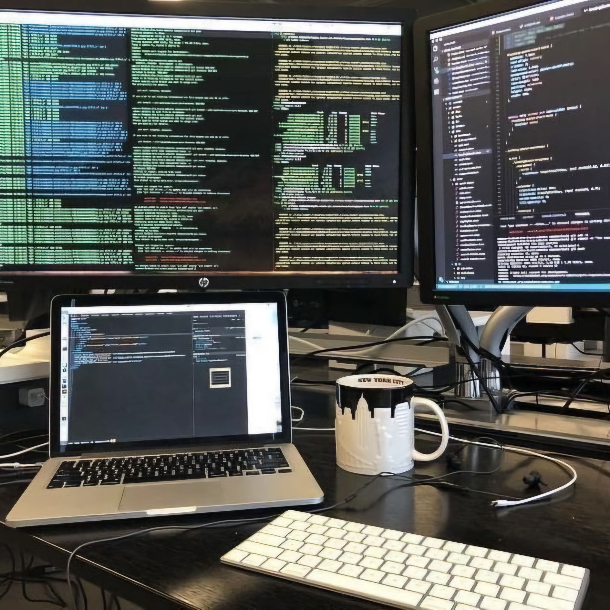
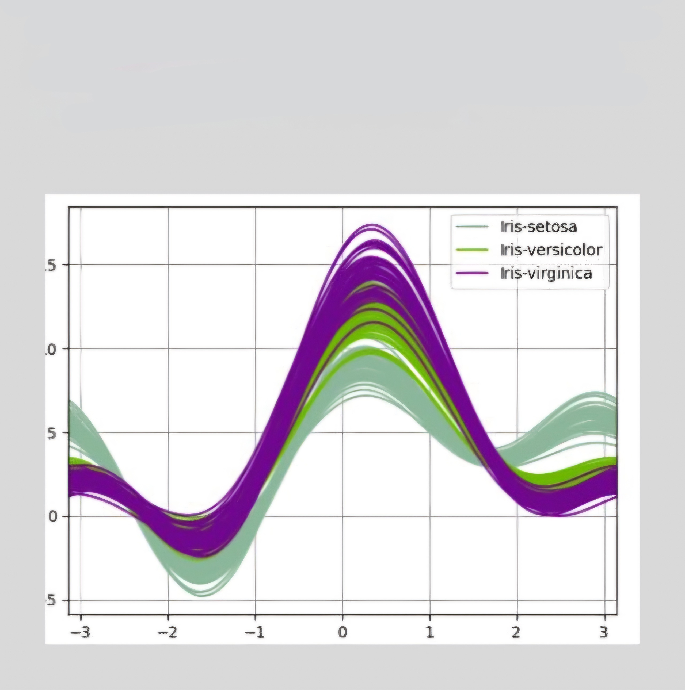

 
 
  
# Hi, I'm Shravya! 👋

## 🛠️ Skills & Tools

## 📊 GitHub Stats
<picture>
  <source media="(prefers-color-scheme: dark)" srcset="https://github-readme-stats.vercel.app/api?username=ShravyaMalogi&show_icons=true&theme=tokyonight">
  <source media="(prefers-color-scheme: light)" srcset="https://github-readme-stats.vercel.app/api?username=ShravyaMalogi&show_icons=true&theme=solarized-light">
  
</picture>
 
<picture>
  <source media="(prefers-color-scheme: dark)" srcset="https://github-readme-stats.vercel.app/api/top-langs/?username=ShravyaMalogi&layout=compact&theme=radical">
  <source media="(prefers-color-scheme: light)" srcset="https://github-readme-stats.vercel.app/api/top-langs/?username=ShravyaMalogi&layout=compact&theme=solarized-light">
  
</picture>

## 🚀 Projects
<table>
  <tr>
    <!-- Image in [0][0] -->
    <td>
      
    </td>
    <!-- Text in [0][1] -->
    <td>
      
<strong>Task Manager</strong>

      
A tool for keeping up with tasks and works in an organized manner

    </td>
  </tr>
</table>

## 📂Repositories
<table style="border-collapse: collapse; border-spacing: 0;">
  <tr>
    <!-- Repository 1 -->
    <td align="center" style="padding: 0;">
      <a href="https://github.com/ShravyaMalogi/C">
        
        
<strong>C</strong>

      </a>
    </td>
    <!-- Repository 2 -->
    <td align="center" style="padding: 0;">
      <a href="https://github.com/ShravyaMalogi/hackerrank-solutions-sql">
        
        
<strong>SQL</strong>

      </a>
    </td>
    <!-- Repository 3 -->
    <td align="center" style="padding: 0;">
      <a href="https://github.com/ShravyaMalogi/Machine_Learning">
        
        
<strong>ML</strong>

      </a>
    </td>
  </tr>
</table>

## 📂 Pinned Repositories

  <!-- Repository 1 -->
  
  <!-- Repository 2 -->
  
  <!-- Repository 3 -->
  

## 🌐 Connect with Me

  
  

## 🧘‍♂️ Truth Bomb
"The question isn't who's going to let me; it's who's going to stop me." – Ayn Rand

